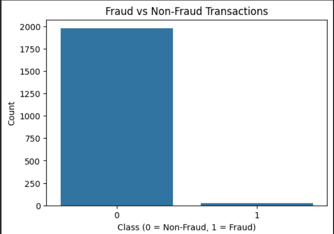
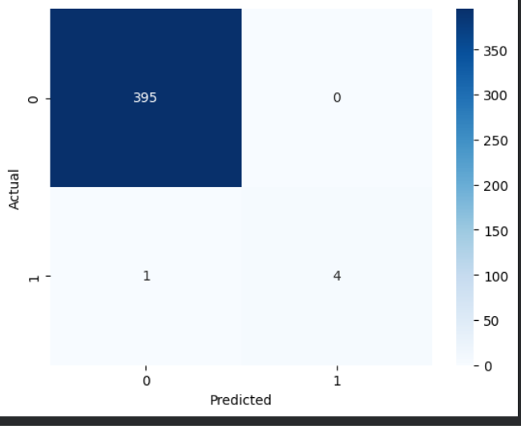
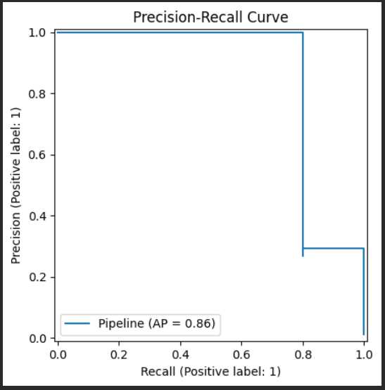
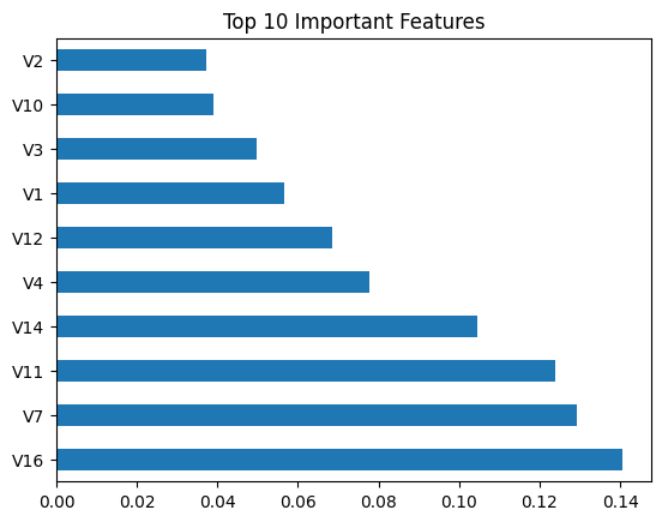
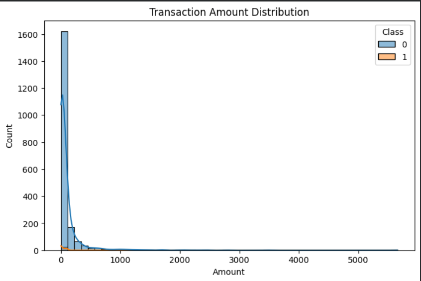

# Credit_card_fraud_project
"Built a fraud detection model achieving 99% accuracy with end-to-end Machine Learning pipeline to detect fraudulent credit card transactions using SMOTE for imbalance data handling and Random Forest for classification."

##  Visualizations

### Fraud vs Non-Fraud Transactions
This shows the imbalance in dataset where fraud cases are very rare.

---

### Confusion Matrix
Model performance showing correct and incorrect predictions.

---

### Precision-Recall Curve
Precision-Recall Curve illustrating the model's efficiency in balancing detection accuracy and fraud identification.

---

### Feature Importance
This highlights the most important variables that drive the model's decision-making process in detecting fraudulent activities.

---

### Transaction Amount Distribution
This illustrates the spread and density of transaction values, helping to identify specific amount ranges where fraud is more prevalent.

